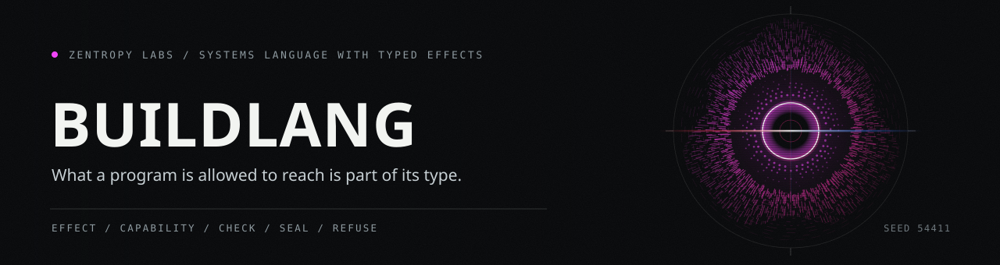

<p align="center"></p>

**A real systems language: typed capability effects, sum and linear types, C FFI, native binaries.**

[](https://crates.io/crates/buildlang/)
[](LICENSE)
[](https://crates.io/crates/buildlang/)

[](https://github.com/HarperZ9/buildlang/actions/workflows/ci.yml)
[](https://github.com/HarperZ9/build-universe)

BuildLang compiles `.bld` source to native binaries through a C backend, emits
HLSL and GLSL for shader work, and carries experimental SPIR-V, LLVM IR,
WebAssembly, Rust, x86-64, and ARM64 backends. The type system pairs
Hindley-Milner inference with typed algebraic effects and an opt-in
experimental `#[linear]` attribute for no-cloning values. The `buildc` CLI
covers build, run, test, repl, fmt, pkg, watch, and doctor, plus a bundled LSP
server with completion, hover, diagnostics, and go-to-definition. Every checked
build can write a receipt you can re-check.

[Landing page](https://harperz9.github.io/buildlang/) | [Build ecosystem](https://github.com/HarperZ9/build-universe) | [VS Code extension](https://github.com/HarperZ9/buildlang-vscode) | [grammar](https://github.com/HarperZ9/buildlang-tmLanguage)

## Highlights

- **Typed capability effects.** Ambient access is part of a function's type.
  Calling `read_file` requires `~ FileSystem` in the signature, `tcp_connect`
  requires `~ Network`, an `extern` call requires `~ Foreign`, and
  compile-time macros like `include_str!` and `env!` are gated the same way.
  The checker tracks effects through function values, closures, struct fields,
  control flow, and async blocks, so a callback cannot silently launder a
  capability. See [docs/EFFECTS_GUIDE.md](docs/EFFECTS_GUIDE.md).
- **Native binaries through C.** The C backend is the production execution
  path: `buildc run` compiles to C, invokes your system C compiler (gcc,
  clang, or MSVC), and runs the result. One command, one binary.
- **Two-way C FFI.** `extern "C" link "sqlite3" header "<sqlite3.h>"` calls a
  third-party C-ABI library and links it in one build; `extern "C" fn`
  exports a BuildLang function with a stable symbol, and
  `buildc build --emit header` writes the matching `.h` for C and C++
  consumers.
- **Shader output.** `#[fragment]` functions compile directly to HLSL (for
  ReShade and DirectX) or GLSL (for OpenGL and Vulkan). See
  [docs/SHADER_GUIDE.md](docs/SHADER_GUIDE.md).
- **GPU compute (experimental).** `#[compute]` kernels compile to
  dispatchable SPIR-V validated by spirv-val, and a build with
  `--features gpu` adds `buildc run --gpu`, which dispatches the kernel on a
  physical Vulkan device and cross-checks the readback against the CPU
  scalar loop. Workgroup shared memory and barriers are supported.
- **Experimental linear types.** An opt-in `#[linear]` attribute marks a
  struct or enum as no-cloning: a value should be moved at most once, the
  shared foundation of qubit, no-double-spend, and resource-handle
  disciplines. It rejects a large regression-tested set of escapes but is not
  yet fully sound; honest scope in
  [docs/LINEAR-TYPES.md](docs/LINEAR-TYPES.md).
- **Full toolchain in one binary.** `buildc` bundles build, run, check, test,
  repl, fmt, lint, pkg, watch, doctor, an LSP server, MIR and BDF utilities,
  and receipt tooling. No separate installs.
- **Re-checkable receipts.** `buildc check --receipt` seals what a build
  observed (effects, capabilities, source digests) into JSON that
  `buildc receipt verify` re-derives later; a second receipt family witnesses
  numeric program output against stated invariants.

## Install

From crates.io (installs the `buildc` binary):

```bash
cargo install buildlang
```

> Previously published as `quantalang`; that crate is deprecated and points
> here. Use `buildlang` / `buildc`.

Or build from the repository source:

```bash
cd compiler
cargo build --release
```

Add `compiler/target/release/buildc` (`buildc.exe` on Windows) to your PATH,
then verify the local toolchain (C compiler, stdlib, optional backend tools):

```bash
buildc doctor
```

## Quick start

Create `hello.bld`. `println!` is a `Console` capability, so `main` declares
the effect:

```build
fn main() ~ Console {
    println!("Hello from BuildLang!");
}
```

Compile and run through the C backend:

```bash
buildc run hello.bld
# Hello from BuildLang!
```

The repository ships tested quickstart programs:

```bash
buildc run examples/quickstart/hello.bld
buildc run examples/quickstart/ledger.bld          # prints: balance: 115
buildc run examples/quickstart/effects_greeting.bld
buildc examples/quickstart/vignette_shader.bld --target hlsl -o vignette.hlsl
```

Or emit C and build it yourself:

```bash
buildc hello.bld -o hello.c
cc hello.c -o hello && ./hello
```

## Worked example: effects and a policy gate

`buildc check` reports the capability surface of a program and can enforce a
policy over it. Check the hello program against the built-in `console-only`
profile and print a receipt:

```bash
buildc check examples/quickstart/hello.bld --profile console-only --receipt -
```

Output (excerpt, verified against buildc 1.2.0):

```
Type checking... OK

No errors found in 'examples/quickstart/hello.bld'
{
  "schema": "buildlang-check-receipt/v1",
  "compiler_version": "1.2.0",
  "status": "passed",
  "declared_effects": { "main": ["Console"] },
  ...
}
```

<p align="center"></p>

If the program also read a file, the check would fail until `main` declared
`~ FileSystem` and the policy allowed it. Built-in profiles: `pure`,
`console-only`, `offline`, `ci-review`, and `strict-accountability`
(`buildc policy list`). Save a receipt to a file and re-verify it later with
`buildc receipt verify receipt.json --expect-profile ci-review`; verification
re-runs the check against current source bytes and digests, so drift fails
with a typed reason.

## The buildc CLI

| Command | Purpose |
|---|---|
| `buildc <file>` | Compile a file; `-o`, `--target`, `-O 0-3`, `-g` |
| `buildc run <file>` | Compile and run via the C backend; `--emit-receipt`, `--invariant`, `--units`, `--gpu` |
| `buildc build [path]` | Build a project; `--emit c\|header\|exe`, `--release`, `--target`, `--keep-c` |
| `buildc check <file>` | Type-check; `--receipt`, `--policy`, `--profile`, `--expect-profile-digest` |
| `buildc test [dir]` | Run `.bld` programs against `.expected` files |
| `buildc fmt` / `buildc lint` | Format (`--check`, `--write`) and lint source |
| `buildc repl` | Interactive session |
| `buildc lsp` | Bundled LSP server (completion, hover, diagnostics, go-to-definition, semantic tokens) |
| `buildc watch [path]` | Recompile on change (`--target spirv\|c`) |
| `buildc pkg` | Package manager (`init`, `add`, `resolve`, `search`) |
| `buildc mir emit\|load` | Emit or load the versioned `buildlang.mir/v0` JSON interlingua |
| `buildc bdf` | Build Data Format: `encode`, `decode`, `validate`, envelope bridges |
| `buildc policy list\|print\|scaffold` | Built-in check policy profiles |
| `buildc receipt verify\|export` | Re-check saved receipts; export witnessed measurement rows |
| `buildc corpus verify` | Verify the semantic corpus receipts and real C stdout |
| `buildc doctor` / `buildc version` | Toolchain diagnosis; version info |

Full flags: `buildc --help` and `buildc <command> --help`. The command
reference with expected output lives in [USAGE.md](USAGE.md).

## Backends

<p align="center"></p>

| Target | Flag | Output | Status |
|---|---|---|---|
| C | `--target c` (default) | `.c` / executable | Production |
| HLSL | `--target hlsl` | `.hlsl` | Working |
| GLSL | `--target glsl` | `.glsl` | Working |
| SPIR-V | `--target spirv` | `.spv` | Experimental (compute kernels validate under spirv-val) |
| LLVM IR | `--target llvm` | `.ll` | Experimental |
| WASM | `--target wasm` | `.wasm` | Experimental |
| Rust | `--target rust` | `.rs` | Experimental (subset, validated with rustc) |
| x86-64 | `--target x86-64` | `.o` | Experimental |
| ARM64 | `--target arm64` | `.o` | Experimental |

An 8-program semantic corpus pins C-backend behavior: `buildc corpus verify`
checks the manifest, the C and Rust execution receipts, and real C-backend
stdout together.

## Scientific-runtime receipts

`buildc run --emit-receipt <path> --invariant <name>` captures a numeric
program's stdout as a measurement series, checks a stated invariant over it,
and seals a re-checkable JSON receipt; `buildc receipt verify` re-derives it
by re-running the program. The invariant family has eight members
(`energy-monotone`, `conservation`, `bounded`, `energy-identity`, `relation`,
`conserved-band`, `non-negative`, `cross_backend_columns_agree`), each with a
paired negative-fixture kernel that must fail for the right reason.
`--units m/s` canonicalizes a declared physical unit through a
dependency-free SI dimensional-analysis core before sealing.

The same schema seals five distinct computation modes end to end:
deterministic, exact-probabilistic (a quantum amplitude), seeded stochastic
(the `Random` capability, witnessed seed), Monte Carlo (`--mc-estimator` /
`--mc-samples` / `--mc-interval`, sealing the estimator's declared
denominator and interval method), and budgeted heuristic search
(`--budget-steps` / `--budget-consumed`, sealing the step ceiling and a
derived exhaustion flag), plus a cross-backend bonus mode that runs one
kernel through both the C and Rust backends and checks their agreement.
`buildc receipt chain` binds any number of receipts into one ordered,
tamper-evident bundle. A `Model` capability exists for calling out to a
model over TCP; the receipt layer refuses outright to emit or verify a
receipt over a Model-observing program, because models propose and oracles
dispose.

<p align="center"></p>

The mode is not decoration on the seal. A Monte Carlo receipt carries its
estimator, its sample count, and the interval method that produced the interval;
a budgeted-search receipt carries the step ceiling and whether the search
exhausted it. A number without the terms it was measured under is not a result,
so those terms are sealed beside it rather than left in the prose around it.

Run it now:

```bash
# emit a receipt from the flagship kernel, then verify it
buildc run examples/heat_equation_energy.bld --emit-receipt receipt.json \
  --invariant energy-monotone --problem 1d-heat-equation-energy
buildc receipt verify receipt.json

# run the full 30-member example corpus (paired PASS / FAIL_EXPECTED kernels)
buildc receipt corpus examples/scientific-corpus.json

# emit one receipt per mode (docs/FIVE-MODES-TOUR.md has all six commands),
# then chain and verify the bundle
buildc receipt chain build det.json prob.json stoch.json mc.json heur.json cross.json -o chain.json
buildc receipt chain verify chain.json
```

Walk all five modes plus the cross-backend bonus one command at a time:
[docs/FIVE-MODES-TOUR.md](docs/FIVE-MODES-TOUR.md). Full schema, flags, and
failure-class reference:
[docs/SCIENTIFIC-RECEIPT.md](docs/SCIENTIFIC-RECEIPT.md) and
[docs/DIMENSIONAL-ANALYSIS.md](docs/DIMENSIONAL-ANALYSIS.md).

Honest scope: a receipt witnesses that the compiled program's observed
output series satisfies the stated invariant over that one run, never a
physical law (`NOT_A_NEW_PHYSICAL_LAW`); a budgeted-search receipt reports an
incumbent under its declared step ceiling and never claims optimality
(`NOT_PROVES_OPTIMALITY`); a Monte Carlo receipt seals the estimator's
declaration discipline (denominator, seed, interval method), not the
correctness of the interval.

## Status and maturity

BuildLang 1.2.x. The C backend, capability-effect checking, HLSL/GLSL
output, and the receipt tooling are the verified core; SPIR-V, LLVM IR, WASM,
Rust, x86-64, ARM64, GPU dispatch, and `#[linear]` types are labeled
experimental and stay that way until their evidence says otherwise. The
release-shaped baseline (2026-08-01, local `cargo test` from `compiler/`):
1704 tests passing, 0 failing (11 ignored), 136 source files, 142,792 lines.
The corpus is 30 `.bld` example kernels and 8 C-execution receipts.
Ground-truth release evidence lives in
[STATUS.md](STATUS.md); [CHANGELOG.md](CHANGELOG.md) tracks changes.

## Boundary receipts

BuildLang verifies computation through sealed, re-checkable receipts. Two
boundary receipt kinds extend this discipline beyond the compiler itself:

- **Model boundary receipts** (`buildlang-model-boundary-receipt/v0`): witness
  that a `Model`-capability call crossed the boundary between the harness and a
  model daemon. The harness-side shim emits the receipt; `buildc receipt verify`
  reads it. A model-observing program is refused a scientific receipt with
  `CAPABILITY_INADMISSIBLE` (models propose, oracles dispose).
- **Tool-call receipts** (`flywheel.tool-call-receipt/v1`): witness that an agent
  tool invocation occurred, binding the tool name, capability class (read / write
  / exec / external-mcp), admission decision, and witnessed args/output digests.
  The Flywheel harness emits these; `buildc receipt verify` reads them with a
  golden-pinned cross-language seal contract (Rust serde_json agrees byte-for-byte
  with Python json.dumps). This is the enforced AgentRiskBOM primitive.

Both share a seal idiom and the closed failure taxonomy
(`MALFORMED`, `SEAL_MISMATCH`, `DIGEST_MALFORMED`, `FIELD_CONTRACT_VIOLATION`)
with the scientific receipt verifier, and compose into receipt chains.

## Documentation and ecosystem

- [docs/INTRODUCTION.md](docs/INTRODUCTION.md): what BuildLang is and your first ten minutes
- [USAGE.md](USAGE.md): full command reference with verified output
- [docs/GETTING_STARTED.md](docs/GETTING_STARTED.md): tutorial from install to shaders
- [docs/EFFECTS_GUIDE.md](docs/EFFECTS_GUIDE.md): the capability-effect system
- [docs/LINEAR-TYPES.md](docs/LINEAR-TYPES.md): linear types, enforced vs open
- [DESIGN.md](DESIGN.md) and [ARCHITECTURE.md](ARCHITECTURE.md): pipeline and rationale
- Peers: [build-universe](https://github.com/HarperZ9/build-universe),
  [buildlang-vscode](https://github.com/HarperZ9/buildlang-vscode),
  [buildlang-tmLanguage](https://github.com/HarperZ9/buildlang-tmLanguage)

<p align="center"></p>

The mark at the top of this page is generated from the repository name, so every
tool in this family carries a different one. The banner above is buildlang's own,
drawn by hand and kept. The mark and the two diagrams on this page are rendered
from `docs/art/buildlang.art.json` by `tools/render_repo_art.py`, and a gate
re-renders each drawing and compares it against what is committed, so a label
edited without a re-render fails CI instead of shipping.

Contributor checks before changing public behavior: `cargo test` and
`cargo fmt --check` from `compiler/`, `buildc doctor`, and
`buildc corpus verify`. See [CONTRIBUTING.md](CONTRIBUTING.md).

## Why receipts

Every claim above that could drift, backend maturity, corpus behavior,
capability surfaces, numeric invariants, is backed by a receipt a third party
can re-check with one command. That is the design stance: evidence you can
re-run beats assertions you have to trust.

## License

BuildLang Fair-Source License v1.0, source-available, not open source: read
it, run it, build on it; commercial use that competes with the project is
reserved. See [LICENSE](LICENSE).
